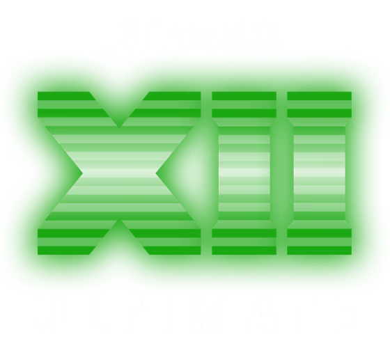

# My Computer Graphics Programming Roadmap
This project's sole purpose is for me to remind myself of what I need to do in order to become a graphics engineer. If you plan to use this for yourself please take some time to read the sections of each stage in this graphics programming roadmap, to make sure it fits with what you want to do! ~~I might also make the same roadmap on my [Website](https://j-2k.github.io) WIP.~~

***VERY IMPORTANT NOTE! Since this repository is gaining some stars, I feel the need to address the fact that this roadmap is how I plan to venture through graphics programming AS A LEARNER, I AM NOT an already established expert in the field! So for this reason you might actually prefer this over other roadmaps as we are both learners(?)! Anyways these graphics roadmaps are pretty much very close/the same.***

In order to not waste your time, I want to say that graphics is heavy in mathematics & computer science, and is very punishing to people that dont bother with the math! If you are a person that hates & doesn't like math, then graphics engineering probably isn't for you, but if you like math but see it as difficult you can become a graphics engineer with enough effort! Additionally later on if you dont like graphics engineering anymore & want to do something still related but is more lenient in the math section, you can become a technical artist instead! (This role is still challenging but much more fun!) Technical Artist roadmap when? I will maybe make one later...

Finally, if I make a spelling/grammar mistake feel free to make a pull request.

### Stars Appreciation
- Thank you all for the support & the 25 stars achieved - 8/23/2024! 🥳
- Thank you all for the 50 stars & Happy late new year! *The graphics journey is challenging, may you overcome all obstacles-Godspeed, my brothers & sisters!*  - 1/6/2025! 🎊

# Contents
- [Pre-Roadmap advice from me as a learner!](#pregraphics) My honest advice, I suggest you read if you are new to graphics!
0. [Roadmap start & Graphics advice from professionals](#graphics) 
1. [Math & C++](#m&c1)
2. [Raytracing](#raytracing2)
3. [Software Renderer](#rasterizer3)
4. [Graphics Specialization](#gfxspec4)
5. [Diving Deep](#dd5)
6. [Miscellaneous Notes & Life Advice](#mn6)
7. [My personal progression with graphics!](#juma)

# <a name="pregraphics">Pre-Roadmap honest advice!</a>

- Firstly, *Learn the Math it's the one and only thing important, especially when it comes to graphics programming. Even more so than C++.* Learn it to the point where you can understand almost exactly what is happening, because if you do, you will have an easier time in everything, from problem-solving to debugging, & etc, especially in the future.

*If you are not interested in my personal advice before starting graphics engineering (I suggest you continue reading since I am a learner like you!), skip to the graphics advice of professionals by clicking [here](#ga0) or start the graphics pre-requisites section by clicking [here](#m&c1).*

---

**Advice from me after I did some graphics projects!** 
  
- After doing some graphics, I realized math is insane and beautiful... and *really* fucking hard. Additonally, slowly try to learn some math notation when you are bored, since graphics concepts (especially on wikipedia) are mostly shown in ugly and scary math symbols. Example: Do you know what sigma or product do & what they look like? What does the cross product and dot product do/look like? Integrals??? Rendering equation?!?!? What the fuck is Calculus??? 🗣🗣🗣🔥🔥🔥

---

Jokes aside, here are some answers to the previous questions:

$$\large \sum_{sigma}^{im} | \prod_{product}^{im} | \int_{integral}^{im}$$

$$\large Rendering \ Equation\Rightarrow  L_o(\mathbf{x}, \omega_o) = L_e(\mathbf{x}, \omega_o) + \int_\Omega f_r(\mathbf{x}, \omega_i, \omega_o) L_i(\mathbf{x}, \omega_i) (\omega_i \cdot \mathbf{n}) \, d\omega_i$$

---

*An example of what you will see on wikipedia! (Literally STOLEN from wikipedia btw!)*  
Try to guess what this is if you have done some game development previously! Spoilers below!  

  
Click here to reveal the answer!

  Rotation Matrix! Rotating around Z then Y then X!

$$ \large
R = R_{z}(\gamma) \, R_{y}(\beta) \, R_{x}(\alpha) =
\begin{bmatrix}
    \cos \gamma & -\sin \gamma & 0 \\
    \sin \gamma & \cos \gamma & 0 \\
    0 & 0 & 1 \\
\end{bmatrix}
\begin{bmatrix}
    \cos \beta & 0 & \sin \beta \\
    0 & 1 & 0 \\
    -\sin \beta & 0 & \cos \beta \\
\end{bmatrix}
\begin{bmatrix}
    1 & 0 & 0 \\
    0 & \cos \alpha & -\sin \alpha \\
    0 & \sin \alpha & \cos \alpha \\
\end{bmatrix} $$

$$ \large
= \begin{bmatrix}
    \cos \beta \cos \gamma & \sin \alpha \sin \beta \cos \gamma - \cos \alpha \sin \gamma & \cos \alpha \sin \beta \cos \gamma + \sin \alpha \sin \gamma \\
    \cos \beta \sin \gamma & \sin \alpha \sin \beta \sin \gamma + \cos \alpha \cos \gamma & \cos \alpha \sin \beta \sin \gamma - \sin \alpha \cos \gamma \\
    -\sin \beta & \sin \alpha \cos \beta & \cos \alpha \cos \beta \\
\end{bmatrix} 
$$

---

*An example of Sigma being used, in a VERY popular math operation! (Literally STOLEN from Google btw!)*  
Again! Try to guess what this formula is being used in! Spoilers below!  

  
Click here to reveal the answer!

  Dot Product!  Images from Google & Nvidia CG

  

$$ \large ? = \sum_{i=1}^{n} a_i b_i $$

---
# <a name="graphics">Graphics Roadmap</a>
***START OF THE GRAPHICS ROADMAP, THE ORDER IS IMPORTANT & IT'S OKAY TO DEVIATE BUT NOT TOO FAR FROM EACH INDEX.***

## <a name="ga0">0. Graphics Advice</a>
*You can skip this as I list my resources in order according to many sources when it comes to learning CG*
- [Beginner Computer Graphics Starter Guide](https://erkaman.github.io/posts/beginner_computer_graphics.html) Erkaman's guide on starting Computer Graphics.
- [Graphics Programming Github Page](https://graphics-programming.org/resources/) Made up from people of the Graphics Programming Discord Server.

# <a name="m&c1">1. Math & C++ (Prerequisite Resources!)</a>
*As I said previously, math is THE most important section of all graphics, Good Luck!*  
Learn these 3 topics > Linear Algebra, Trigonometry, C++.
- [MathIsFun.com Trigonometry](https://www.mathsisfun.com/algebra/trigonometry.html) For Learning Trigonometry & MathIsFun can be used to learn almost everything needed!
- [Immersive Mathemathics](https://immersivemath.com/ila/index.html#), Learn math needed through a website that shows mathematics in an immersive 3D environment.
- [Essence of linear algebra](https://www.youtube.com/playlist?list=PLZHQObOWTQDPD3MizzM2xVFitgF8hE_ab) Learning Linear Transformations, & see how they move in space via video (3blue1brown).
- [Cherno C++ Series](https://www.youtube.com/playlist?list=PLlrATfBNZ98dudnM48yfGUldqGD0S4FFb) Chernos C++ Series for the pre-requisite section (Video Format)
- [Learn CPP Website](https://www.learncpp.com) Learn C++ website, literally everything covered (Reading Format)
- [Scratchapixel](https://scratchapixel.com) You can learn all math prerequisites in here (Geometry Section) & other computer graphics topics!
- [3D Graphics Overview -  Mathematics for Graphics](https://www.youtube.com/playlist?list=PLlWgYfV78e0lRd_k8RXTBYZUlq4q3D62X) Underrated videos that explain the mathematics behind 3D graphics concepts, you dont have to go through all the videos if you know some topics but make sure to watch something you struggled to understand! (Video format)

# <a name="raytracing2">2. Raytracing</a>

First graphics project will be simple raytracing! **(Basically 1 math formula, understand it!)**   
All resources below will cover the math & implementation, pick your poison.  
- [Cherno Raytracing Series](https://www.youtube.com/playlist?list=PLlrATfBNZ98edc5GshdBtREv5asFW3yXl) (REAL TIME RAYTRACER) Cherno Raytracing Guide that im following.
- [Raytracing in 1 Weekend](https://raytracing.github.io) (OFFLINE RAYTRACER) Infamous book for learning raytracing.
- [Scratchapixel, Intro to Raytracing](https://scratchapixel.com/lessons/3d-basic-rendering/introduction-to-ray-tracing/how-does-it-work.html) (OFFLINE RAYTRACER) Scratchapixel raytracer, but personally, I would go with 1 of the other ones above for raytracing. You should also go over scratch a pixels math lessons though for real graphics programming!
- [Ssloy Tiny Raytracer](https://github.com/ssloy/tinyraytracer/wiki/Part-1:-understandable-raytracing) (OFFLINE RAYTRACER) SSloy Raytracer (again id personally go with 1 of the top 2 in this section, you will do ssloy renderer instead which is much more important!).

# <a name="rasterizer3">3. Software Renderer & Graphics Pipeline Foundations</a>

  

**IMPORTANT! THIS STEP IS SKIPPABLE BUT READ BEFORE DECIDING!**

Diving directly into a GFX API while just previously writing just a raytracer is usually possible, however nothing related the the graphics pipeline & the foundations of graphics programming has been taught yet, usually at this stage if you skip that means you will be learning how the GFX Pipeline works AND a graphics specification. That is the main problem, & thats why this section exists and is heavily recommended to first learn how the graphics pipeline work because knowing this inside out will make everything easier in the future!

The point here is to teach you LITERALLY what a graphics specialization (API) is doing for you, which means you will do everything that the graphics specialization does for you in the back, this will help you understand most of the things in the future when you start & pick a graphics API to use.

## Learning the Foundations of the Graphics Pipeline
This will serve as a starting point of learning what the graphics pipeline is and should be a light introduction that is fun to read for the user. I tried picking resources that I found funny and/or fun to read, before directly jumping into programming a software renderer (CPU Renderer).

- [Graphics Pipelines for Young Bloods](https://www.jeremyong.com/cpp/2021/05/20/graphics-pipelines-for-young-bloods/) Amazing introduction & read to what the graphics pipeline is and the common issues in it!
- [Gentle Introduction to Computer Graphics](https://www.scratchapixel.com/index.html) scratchapixel's website, I linked the index page, but just enter the page that says "1. Your Starting Point!", I linked the index page because the website covers many topics that you might struggle to understand later on, so briefly scroll through it just incase in the next section when you struggle to understand something you can come back here!
- [Trip through the Graphics Pipeline](https://alaingalvan.gitbook.io/a-trip-through-the-graphics-pipeline) by alaingalvan, this read is a deeper look into the graphics pipeline but it covers everything very well.

## Writing a Software Renderer
Once you have a rough understanding of what goes on in the graphics pipeline it's time to try to implement one! GL!

- [ssloy](https://github.com/ssloy/tinyrenderer/wiki/Lesson-0:-getting-started) Ssloy's Tiny Renderer, I personally am following this, but if you have another software rasterizer tutorial you are free to choose others ofc, just make sure its good! I just chose this because I see tons of other graphics engineers suggest this!

# <a name="gfxspec4">4. Pick your Graphics Specialization!</a>
**Welcome to Hell! Pick your choice of pain!**  
Here you have 2 choices, I personally read from many engineers & even recruiters/interviewers that you should start with a modern graphics specification (graphics API) rather than old specifications. IMO, I think you should probably start with something easy *FOR LEARNING PURPOSES* & then progress to a harder graphics specification immediately!

Example of what I mean: Start with Modern OpenGL OR DirectX11 and once you are comfortable move on to either Vulkan OR DirectX12! (But if you have a death wish & unlimited free time you can just jump into Vulkan & become a gigachad GL 👑)

Important notes about some of the Graphics API:  
- DX (DirectX) is specialized for windows platform only!
- Vulkan & OpenGL is cross-platform (everything)!
- Rough difficulty tier list of the API's from the hardest on the left to easiest on the right: ***Vulkan >= DX12 > WebGPU? >= DX11 > OpenGL > WebGL*** (I'm not sure on the placement of WebGPU but take it with a grain of salt or do some more research).
- If you want to learn graphics for the web only, you can directly jump into WebGPU but that is assuming you already know how the math works & structure of a graphics pipeline. WebGL is very dumbed-down compared to OpenGL & WebGPU but it's not a bad idea to do it first before WebGPU, I'd recommend it anyway, just dont waste too much time on it!
- **LEARN MODERN VERSIONS OF THE API YOU CHOOSE. IT IS VERY IMPORTANT** that you choose a modern verison of a API you choose, for example never do DX8/9/10 over DX11, the same goes for OpenGL stay away from old versions like pre-3.0, for modern OpenGL versions 4.3+ is good or the latest stable release at the time of writing this is 4.6 (Basically, just choose the latest stable release version!).

Commonly when people see the features of GFXAPIs they just go with a crossplatform API, while that's fine it's important to also note that if you plan on targeting windows only DirectX *"usually"* **(context is massive)** outperforms cross-platform APIs, However I'm pretty sure Vulkan does have lower overhead than DX12!

## Software Based Graphics Specifications!

- [Vulkan Game Engine Tutorials](https://www.youtube.com/playlist?list=PL8327DO66nu9qYVKLDmdLW_84-yE4auCR) Learn Vulkan from Brendan Galea, *THIS RESOURCE IS INSANELY INFORMATIVE & HELPFUL THIS SERIES HELPED ME A TON.* Brendan's videos are amazing.
- [Vulkan Guide](https://vkguide.dev/) Vulkan guide with code examples.
- [Vulkan Tutorial](https://vulkan-tutorial.com/) Most popular Vulkan Tutorial page. 
- [Vulkan Documentation](https://vkdoc.net/) Proclaimed better version of Vulkan Documentation? This is really good, however its more of a documentation style of learning & not a direct guide. 

## 

- [DX12](https://www.3dgep.com/learning-directx-12-1/) Comprehensive guide on learning DirectX 12 by Jeremiah @ 3D Game Engine Programming.
- [DX12](https://learn.microsoft.com/en-us/windows/win32/direct3d12/directx-12-programming-guide) Guide by Microsoft.

##

- [LearnD3D11](https://graphicsprogramming.github.io/learnd3d11/1-introduction/1-1-getting-started/1-1-3-hello-triangle/) Learn DirectX11, from the people @ the graphics programming discord server.

##

- [Learn OpenGL](https://learnopengl.com/) The most popular openGL resource out there.
- [Learning Modern 3D Graphics Programming - paroj](https://paroj.github.io/gltut/index.html) Style is different & uses openGL but the point is to teach you how to program graphics not use OpenGL! not fixed learning & rather more programming read the about for more info.
- [Scratchapixel](https://scratchapixel.com) Learn almost everything you need in the computer graphics domain, this uses OpenGL.
- [Cherno OpenGL Series](https://www.youtube.com/playlist?list=PLlrATfBNZ98foTJPJ_Ev03o2oq3-GGOS2) Learn OpenGL from Chernos OpenGL Series (Probably really old but whatever)

## Web Based Graphics Specifications!

*Note even though this is web, WebGPU can actually run on JS/Rust/C++ etc, so choose the resource on what you enjoy programming in, if you want C++ go with Learn WebGPU, if JS/TS go with WebGPU Fundamentals!*
- [WebGPU Fundamentals](https://webgpufundamentals.org/) by greggman, same author of WebGL Fundamentals, can't go wrong.
- [Learn WebGPU](https://eliemichel.github.io/LearnWebGPU/) by eliemichel, very clean resources & guides.

##

- [WebGL Fundamentals](https://webglfundamentals.org/) by greggman, my personal opinion but I think this is one of the best authors for teaching things, the explanations are clear and simple to understand. 
- [WebGL2 Fundamentals](https://webgl2fundamentals.org/) by greggman, webgl2 is just a better version of WebGL but both are fine, if you are very new I would go with 1 though.
- [Learn WebGL](https://learnwebgl.brown37.net/index.html) by brown37, another good resource I used for learning the basics.

## Additional things to consider learning for GFX Engineers
- GPU Architecture
  - [GPU Optimization for GameDev by silvesthu](https://gist.github.com/silvesthu/505cf0cbf284bb4b971f6834b8fec93d) for this I dont have much resources other than this one big list that has everything related to GPUs, it covers everything such as GPU Architecture, Graphics Pipeline, Optimizations for the GPU, & etc. 
  - [GPU Synchronization & Pre-emption](https://therealmjp.github.io/posts/breaking-down-barriers-part-1-whats-a-barrier/) good read if you are deep into graphics.
- Basic CPU Architecture
  - Useful to understand basic CPU architecture to know why values passed to GPU make things slow, overhead related things, & etc.

## Stay motivated? Or disciplined? Have fun!
This is the most difficult section usually as a beginner in GFX programming, take the time to have some fun with it, make fun projects, dont die out here! Watch people you enjoy do some graphics projects so you can have fun watching it & stay motivated or disciplined. Learn some things you didn't know, like Cherno covering how Bloom is implemented incorrectly in many areas! [Cherno's Bloom Video](https://www.youtube.com/watch?v=tI70-HIc5ro) where he talks about this.  

So have some fun, the more you enjoy doing something the more you learn without even having to feel like you are trying. I'm writing this from experience, so take smart breaks, have fun, watch people you enjoy do things you enjoy! I listed some people I enjoy watching from time to time with their specialization within the graphics space.
- [Cherno](https://www.youtube.com/@TheCherno) Full on Graphics Engineering youtube channel.
- [Acerola](https://www.youtube.com/@Acerola_t) Shader Specialized (specifically post processing/screen based shaders) youtube channel.
- [Brian Will](https://www.youtube.com/@briantwill) The based monster of computer science, watch him yap about the concepts of graphics in his graphics section! 
- [Inigo Quilez](https://www.youtube.com/@InigoQuilez) #1 Shader magician world... probably... easily actually.

# <a name="dd5"> 5. Do fun stuff now! Dive Deeper! Or learn more! (Random Resources) </a>
Here the list will deviate, & you have to do whatever you enjoy and essentially use whatever API you used before & maybe make something for fun, or dive deeper in specific areas for example getting better at shaders (raymarching, FFT water, post processing shaders, GPU instancing etc.). 

## Shaders
I will list each resource's main shader languague & specialization OR engine its on @ the end of the resource **(GLSL/HLSL/CG/Unreal/Unity/OpenGL/DX3D/Vulkan... etc)**, but it should not matter! It's all translatable! Engine Choice or Graphics Specialization choice should not matter as shaders are literally just math garbage and is translatable everywhere! *(yes some things are different but im talking about the big picture)*
  
Shaders can get quite complex, but its all up to your creativity I will list a range of websites that help during all stages of shader development. I have not added specific shaders to do but I will leave that with you to explore with a few to begin with that are fun & kinda "simple" > Fresnel, Toon, Ray Marching & [Shell Texturing](https://www.youtube.com/watch?v=P-vr9w1XpAY) (My shameless video plug :D).

Not really biased but I just want to say if you can understand everything in catlike coding's rendering section and the many articles from IQ (Inigo Quilez), you will master shaders easily (easier said than done lmfao GL).

- Text Format
  - [Catlike Coding](https://catlikecoding.com/unity/tutorials/) It's a crime that I forgot to put this in. Jasper also covers more advanced topics in the Unity Engine like rendering, reflections, tessellation, etc, literally one of the best resources if not the best! **(Unity/CG/HLSL)**
  - [Lettier's Game Shader 4 Beginners](https://github.com/lettier/3d-game-shaders-for-beginners) Has many nice guides for Post Processing and other beginning shader topics **(OpenGL/GLSL)**.
  - [Book of Shaders](https://thebookofshaders.com/) Generalized shader learning resource, one of the best out there! **(GLSL only)**
  - [Inigo Quilez Articles](https://iquilezles.org/articles/) One of the handful that can claim to be a Shader Wizard. Your favourite shader probably has some functions yoinked from this guy 😎 **(GLSL only)**
  
- Video Format
  - [Kishimisu Youtube Channel](https://www.youtube.com/@kishimisu) Mainly this is for people that are BRAND-NEW to shaders & want to learn in video rather than text, Kishi has great quality videos. **(GLSL only)**
  - [Art of Code Youtube Channel](https://www.youtube.com/@TheArtofCodeIsCool) For learning & Writing better shaders using GLSL on Shadertoy **(Mainly GLSL & Some CG/HLSL)**.

- Splash of random Unity Specific shader resources that I used in the past:
  - [Freya Holmer](https://www.youtube.com/channel/UC7M-Wz4zK8oikt6ATcoTwBA) Freya has tons of stuff on their youtube for learning shaders!
  - [Ronja Shader Tutorials](https://www.ronja-tutorials.com/) Many useful shaders with a guide on how they implemented everything!
  - [Roystan's Shader Articles](https://roystan.net/articles/) Simple guides on beginner shader topics! (Roystan was a life saver when I was a student <3)
  - [Ben Cloward](https://www.youtube.com/channel/UCoG9TB1eL6dm9eNbLFueHBQ) Ben does both UNITY & UNREAL, however its all shadergraph, but idea & implementation is all there!

## Dive Deep into Computer Graphics (Advanced)
This advanced section is basically the core for end-game graphics, many people consider PBRT the end stage/industry standard & if you achieve physically based rendering and understand it properly you are in a very good place!
- [Infamous PBR Book](https://pbr-book.org/) Physically Based Rendering Book
- [Real Time Rendering](https://realtimerendering.com/) Core book for Real-Time Graphics

## Extras
- [Extra Graphics Programming Resources](https://www.reddit.com/r/GraphicsProgramming/comments/1d5swt6/computer_graphics_programming_resources/) In case some sections miss out on some resources, here is another post full of graphics programming resources!
- Alternative really good graphics developer roadmap: https://github.com/prographon/graphics-developer-roadmap
- General game programming roadmap with many additional specializations (graphics, multiplayer, etc):
  - https://github.com/miloyip/game-programmer  
  - https://roadmap.sh/game-developer

- [Big Randy Resources (Not just Graphics)](https://github.com/bigrando420/resources/wiki) Big Randy's resources are actually pretty good too.
- [DirectX Tutorial](http://www.directxtutorial.com/Lesson.aspx?lessonid=11-4-1) Seem's a little old but still pretty good, can be subbed out for LearnDXD11, your choice.
- [Brian Will OpenGL Rants](https://www.youtube.com/watch?v=hPmEyAXdOdY&list=PLIbUZ3URbL0ESKHrvzXuHjrcLi7gxhBby) I personally like Brian, I think he does decent videos (some of it is really old but the concept is still valid). IMO I wouldn't follow it as a real tutorial but rather watch the video and try to understand the concept because hes explanations are whats important I feel like not the implementation as much if that makes sense.

# <a name="mn6">Miscellaneous Notes</a>
- Getting A Masters Degree in Computer Science with the final project (the thesis or dissertation whatever the place you choose calls it) based on something related to graphics. This note is for myself, because it sounds fun might do it. Ideas for final project could be a Minecraft Sim / a good raytracer / Voxel Engine & etc. 
- Now throughout all of this notice how I didn't ever mention anything about making a game engine? IMO I think making a game engine is really difficult and takes a SHIT ton of time, if you want to be efficient with your time I think it's something not to do at all early on untill you really are comfortable with graphics! Instead sink your time in making graphics focused projects! A game engine requires support for physics, audio, networking, scripting, models, animation, etc and all the extra garbage that goes in a game engine, I think focusing your time in graphics projects will benefit you more since if you want to become a graphics engineer you will most likely work on the graphics pipeline in a game engine and not the scripting support system, audio or all that extra garbage, let the engine developers do it you will work alongside them anyways (You might also still be forced to join the engine developers (since these roles overlap slightly) & help them do it lmao).
- I want to highlight that I am not frowning upon creating game engines but I think it's more beneficial for you to make graphics projects! Check out these 2 beautiful graphics projects below!!!
1. <strong><i>A very nice example of a [Voxel engine](https://www.youtube.com/watch?v=8ptH79R53c0) by [John Lin](https://github.com/Lin20)</i></strong>  
2. <strong><i>Example of an extremely good [Minecraft Sim](https://www.youtube.com/watch?v=M98Th82wC7c) by [Danol](https://github.com/CZDanol)</i></strong>  

## Life Advice & Closing Notes
Will probably add more stuff here, but I have to mention it's extremely important to find out what you want to do in life, specifically if it's graphics then what with graphics? 
Games Industry? Positions that exist are: 
- Technical Artist/Shader Developer (Maybe even VFX position, dealing with particles & shaders).
- Graphics Engineer / Engine & Graphics Developer.  
(These are the main positions I look for, many other positions also exist just check the image below by hitmarker.)
- Possibly even a research based position if you get really good & can land a place @ NVIDIA.  
Adding this image for you to see more positions that a graphics dev can also work on alongside pursuing graphics. This image was not made by me, credits go to people @ [hitmarker.net](https://hitmarker.net/).

Movies Industry? I don't really know/care about them, so I won't talk about it here. But I heard there are opportunities over there also for graphics people.

## <a name="juma">My progress & chosen resources for graphics! (Not important, you can skip)</a>
#### (in brackets will mark a resource I chose to follow & learn with)
Emoji Keys = ✔️ Completed, ⌛ In Progress, ❌ Not Started
1. Write a software raytracer. ✔️ (Cherno Raytracing Series)  
2. Write a software rasterizer. ✔️ (SSloy Tiny rasterizer, 90% Done)  
3. Write a Hello World Triangle. ✔️ (Use a graphics specialization! WebGL used) 
4. ~~Write a 3D Renderer from the previous step, bonus points for making a mini project here! (⌛ WebGL 3D Mini Project in progress)~~ Started writing a voxel engine renderer instead of a mini project lmfao
   - Diverting a little in between here by using WebGL to make fun stuff before I jump into a more serious graphics specification!
5. Create a 3D project with a stronger Graphics API of choice compared to the last step! (WebGPU or OpenGL in my case, if you come from OpenGL or DX11 try to step up to Vulkan or DX12, if you are already up there, try the other counterpart!) 
   - At the minimum try to render 1 Mesh with lighting & shadow mapping. ❌  

#### By here we are done technically, & now we just have to be passionate & make something or explore other topics such as:  
- PBR (Physically Based Rendering).   
- PPFX (Post Processing Effects like AO (Ambient Occlusion)).  
- Shaders (Ray-marching fun or Fast Fourier transforms for insane water).  
- This can go on forever but by here we can do whatever as long as we are learning, I personally, will have my next steps below.  

#### Fun Section (How I will be continuing)  
6. Create a graphics-focused Minecraft Sim with any Graphics API.  (⌛ Project Voxxer 3D in progress, a voxel engine renderer)
7. [Extras] Extend the Minecraft Sim to feature the following/any:  
+ Lighting & Water Shader
+ Any Post Processing Effects (Motion blur / God Rays / Ambient Occlusion / Depth of Field / Bloom / etc.)
+ Multithreading  

<strong><i>Example of an extremely good [Minecraft Sim](https://www.youtube.com/watch?v=M98Th82wC7c) by [Danol](https://github.com/CZDanol)</i></strong>
